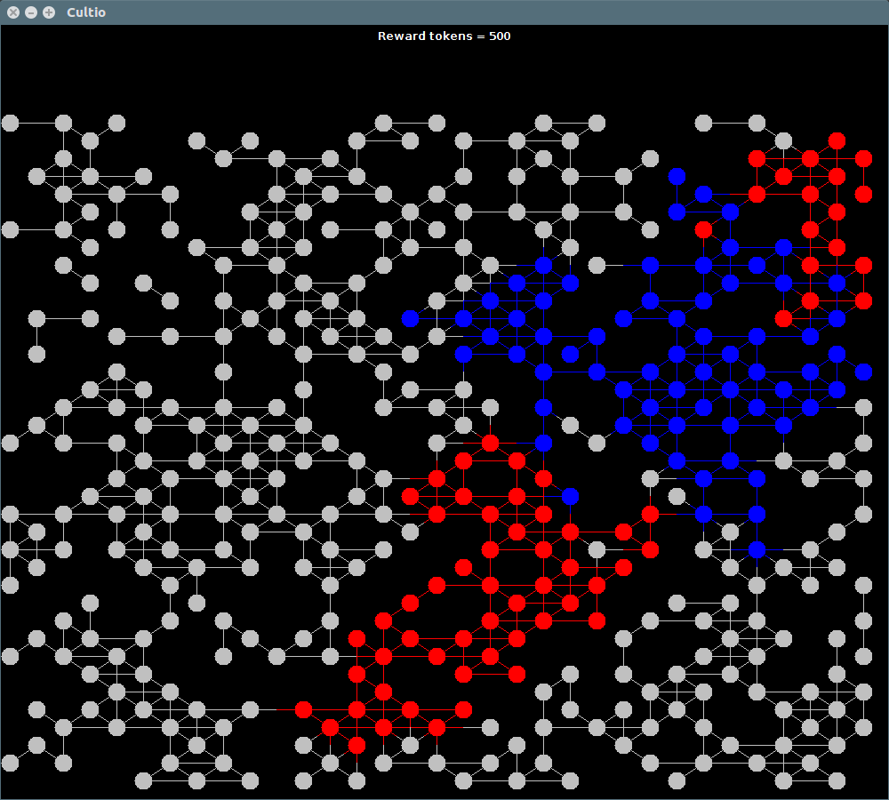

# CultSpread

Cult spread is a Java swing application made in ICHACK 19 by

James Dalboth
Neil Richardson
Rudolfs Spuris

# Gameplay

RTS where you get to manage your own cult and pit it against a rival cult who is also trying to spread it's beliefs across the world. Punish/Reward your followers for different benfits to try and spread your beliefs as effiectly as possible!

